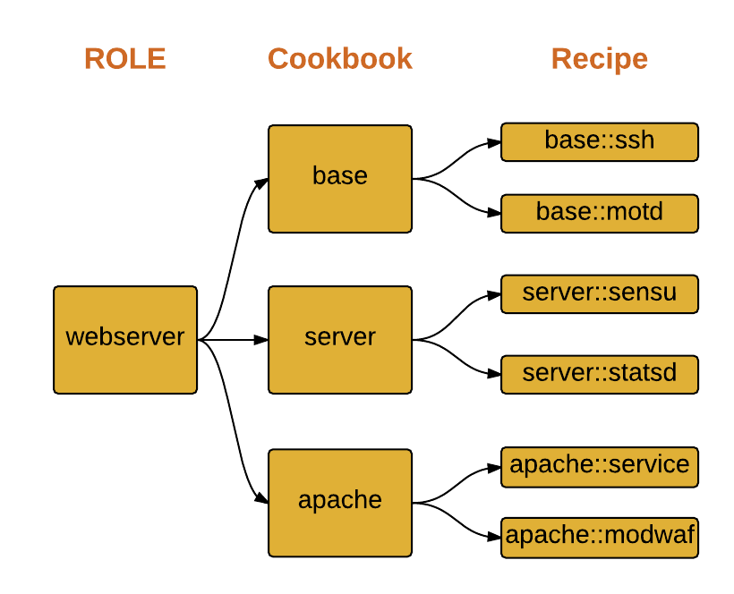

Peter Burkholder 
@pburkholder 
http://pburkholder.com | http://devopsdc.com 
12 May 2016

---

Why care about operations?

Note:  For much of the last few decades many business didn't encourage their developers/engineers to care about operations.  They erected a wall between Eng/Ops, and Eng would toss stuff over to Ops, who were to run it, and when it didn't work, it was an Ops problem.

This started to change in late 2000s, with advent of infrastructure automation tools like CfEngine and Puppet, and the first DevOpsDays in Ghent in 2009, and the seminal Allspaw/Hammond talk at Velocity 2009.

----

Operations is where your business happens

Note: To make a real world analogy; suppose you were a toaster engineer instead of an app developer. You design the best toaster ever, with huge market potential and a great profit margin. What then -- if you don't have a factory floor, or a distribution system, or retail outlets? Then, well, nothing.

So your awesome app is of little utility unless its publicly accessible, over fast networks, with a reliable data store, and secured from attack.  

----

Hence: \*Ops (aka DevOps)

Note: To that end of operationalizing your work, modern business will not have an ops team working in isolation. Instead, they may have an SRE/Devop/Ops team that provides the underlying platform and infrastructure (think network, compute, deployment systems, logging, monitorin), and provide you SMEs to help you ensure your apps operational success

And since it's your app, you have the best domain knowledge to ensure its operational reliability.  You many need help, and you may very well be the person best expected to specify its oprational environment, whether that be a Chef cookbook, Dockerfile or Puppet module.

---

Where does Chef fit in with \*Ops?

Note: Imagine the birth of a system....  How do you communicate? What's your role in life? When should you die?
You may take all your commands over SSH, or if your a MacBook you may get everything from a command line. If you die unexpectedly, how are you replaced

Well, we want to automate this lifecycle...  So at your birth (bootup), you connect to Chef server with some basic information about yourself (hey i'm in this security group, in this VPC) and Chef will give you a cookbook for running your life. And you may need to check in every hour with the mother node to get updated definition of your life.

----

----

Chef is Code 
Code is Testable 
So: [let's do TDD](./README.md)

(Please ASK if I skip over key bits)
